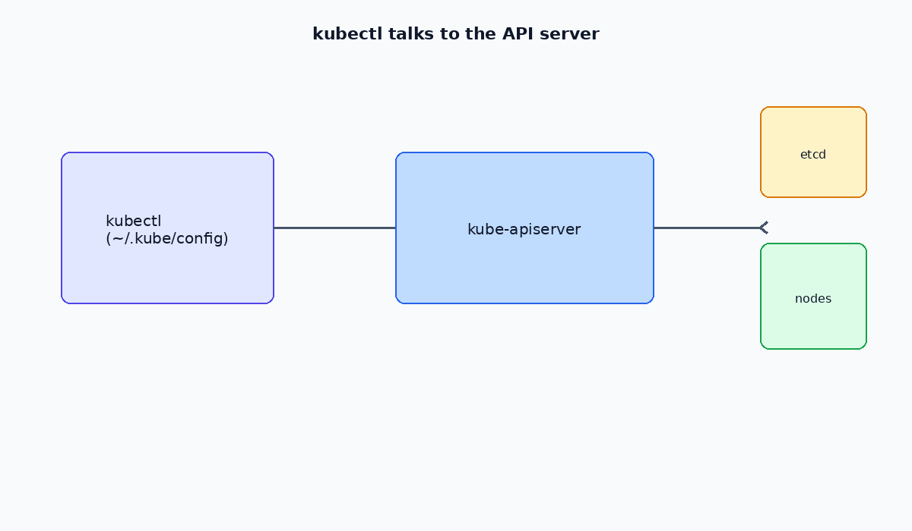

# Kubernetes Command Reference

Common `kubectl` commands for everyday cluster management.

See also: [02-debugging.md](./02-debugging.md) · [03-node-management.md](./03-node-management.md) · [04-labels.md](./04-labels.md)

---




## API discovery

```bash
# List all API resources
kubectl api-resources

# Explain a resource schema
kubectl explain pod
kubectl explain pod.spec.containers
```

---

## Apply manifests

```bash
kubectl apply -f <file-or-directory> -n <namespace>
kubectl delete -f <file-or-directory> -n <namespace>
```

---

## View resources

```bash
kubectl get all -n <namespace>
kubectl get rs,pods,deployments -n <namespace>
kubectl get pods -o wide -n <namespace>
```

---

## ReplicaSet and Deployment

### Scaling

```bash
kubectl scale rs <replicaset-name> --replicas=<count> -n <namespace>
kubectl scale deployment <deployment-name> --replicas=<count> -n <namespace>
```

### Rollouts

```bash
kubectl rollout history deployment <name> -n <namespace>
kubectl rollout history deployment <name> -n <namespace> --revision=<number>
kubectl rollout undo deployment <name> -n <namespace> --to-revision=<number>
kubectl rollout status deployment <name> -n <namespace>
```

### Autoscaling

```bash
kubectl autoscale deployment <name> -n <namespace> \
  --cpu-percent=<target> --min=<min> --max=<max>

kubectl get hpa -n <namespace>
```

---

## Static Pods

Manifests placed in `/etc/kubernetes/manifests/` are managed directly by the kubelet and recreated on reboot. Used for control-plane components.

---

## Copy files

```bash
kubectl cp -n <namespace> <pod-name>:/remote/path ./local-dir
kubectl cp -n <namespace> ./local-file <pod-name>:/remote/path
```
