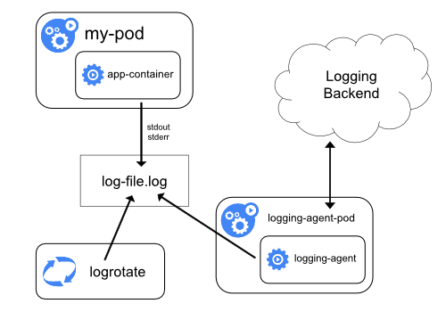

# Logs and debugging

Inspect Pod state, stream logs, and troubleshoot failed workloads.

[← kubectl reference](./01-kubectl-reference.md) · [Kubernetes index](../README.md) · [Node management →](./03-node-management.md)

---



## Stream logs

```bash
# Follow logs from a Pod
kubectl logs -f -n <namespace> <pod-name>

# Multi-container Pod — specify the container
kubectl logs -f -n <namespace> <pod-name> -c <container-name>

# Previous container instance (after a crash/restart)
kubectl logs -n <namespace> <pod-name> --previous
```

> `kubectl logs` requires the Pod to be running (or to have a previous instance). For terminated Pods, use `--previous` or `kubectl describe`.

---

## Describe resources

```bash
kubectl describe pod <pod-name> -n <namespace>
kubectl describe deployment <name> -n <namespace>
kubectl describe node <node-name>
```

`describe` works even when a Pod is not running. Check **Events** at the bottom for scheduling failures, image pull errors, probe failures, and OOM kills.

---

## Quick diagnostics

```bash
# All resources in a namespace
kubectl get all -n <namespace>

# Pod details (IP, node, restarts)
kubectl get pods -o wide -n <namespace>

# Events cluster-wide (recent issues)
kubectl get events -A --sort-by='.lastTimestamp'

# Execute into a running Pod
kubectl exec -it -n <namespace> <pod-name> -- /bin/sh

# Copy files from a Pod
kubectl cp -n <namespace> <pod-name>:/path/to/dir ./local-dir
```

---

## Events

```bash
kubectl get events -n <namespace> --sort-by='.lastTimestamp'
kubectl get events -A --sort-by='.lastTimestamp' | tail -30
```

Events explain scheduling failures, failed mounts, probe errors, and image pulls. Always pair with `kubectl describe`.

---

## Common failure patterns

| Symptom | What to check |
| --- | --- |
| `ImagePullBackOff` | Image name/tag, registry credentials (`imagePullSecrets`), network |
| `CrashLoopBackOff` | `kubectl logs --previous`, entrypoint/command, [probes](../workloads/18-probes.md) |
| `Pending` | Node CPU/memory, taints/tolerations, PVC binding, affinity |
| `OOMKilled` | Memory `limits` too low; describe Pod / node pressure |
| `CreateContainerConfigError` | Missing Secret/ConfigMap referenced by the Pod |
| Service unreachable | `kubectl get endpoints`, selector labels, `targetPort` vs `containerPort` |
| Probe `Unhealthy` | Path/port/timing — see [Probes](../workloads/18-probes.md) |

---

## Related

- [Probes](../workloads/18-probes.md)
- [crictl](./05-crictl.md) — runtime-level view when kubelet looks wrong
