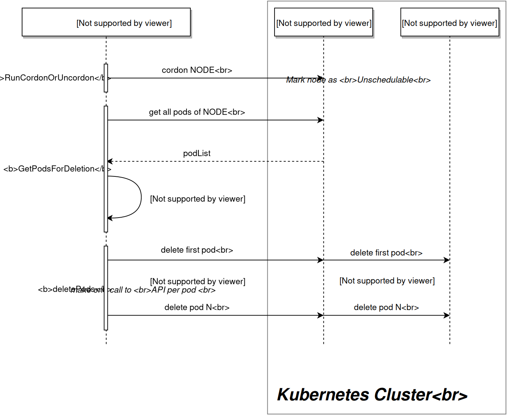

# Node management

List nodes and take them in/out of service for maintenance with cordon, drain, and uncordon.

[← Debugging](./02-debugging.md) · [Kubernetes index](../README.md) · [Labels →](./04-labels.md)

---



## List nodes

```bash
kubectl get nodes
kubectl get nodes -o wide
kubectl get nodes --show-labels
kubectl describe node <node-name>
```

Useful describe fields: **Conditions** (`Ready`, `MemoryPressure`, …), **Taints**, **Allocated resources**, **Events**.

---

## Cordon / uncordon

Cordon marks a node **unschedulable** — existing Pods keep running; new Pods are not placed there.

```bash
kubectl cordon <node-name>
kubectl uncordon <node-name>
```

---

## Drain

Drain cordons the node and **evicts** Pods so you can reboot or remove the machine safely.

```bash
# Typical maintenance drain
kubectl drain <node-name> --ignore-daemonsets --delete-emptydir-data

# Lab / stuck Pods (use carefully)
kubectl drain <node-name> --ignore-daemonsets --delete-emptydir-data --force
```

| Flag | Meaning |
| --- | --- |
| `--ignore-daemonsets` | Required on almost every node (kube-proxy, CNI, …) |
| `--delete-emptydir-data` | Allow eviction of Pods using emptyDir (old name: `--delete-local-data`) |
| `--force` | Continue even if Pods are unmanaged or missing controllers |
| `--grace-period=N` | Override termination grace period |

> Drain disrupts workloads. Ensure Deployments/StatefulSets can reschedule elsewhere, and plan for PodDisruptionBudgets in production.

After maintenance:

```bash
kubectl uncordon <node-name>
```

---

## Related

- [Labels](./04-labels.md) — nodeSelector / affinity
- [DaemonSets](../workloads/06-daemonsets.md)
