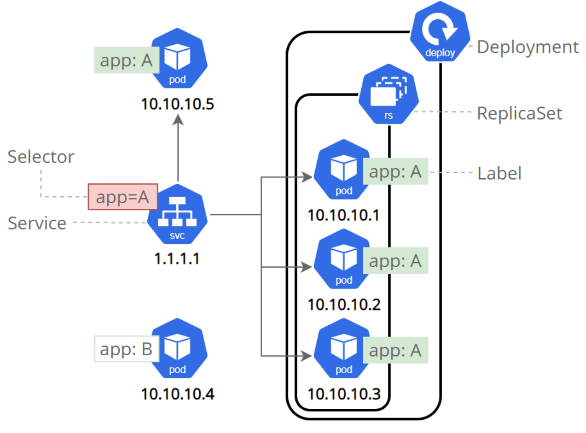

# Labels and selectors

Labels are key/value tags on any object (nodes, Pods, Services, …). **Selectors** find objects by those labels — Services, Deployments, and network policies all depend on them.

[← Node management](./03-node-management.md) · [Kubernetes index](../README.md) · [crictl →](./05-crictl.md)

---



## Workload labels

```bash
# Set / overwrite / remove
kubectl label pod <name> app=web -n <namespace>
kubectl label pod <name> app=api --overwrite -n <namespace>
kubectl label pod <name> app- -n <namespace>

# Query
kubectl get pods -l app=web -n <namespace>
kubectl get pods -l 'app in (web,api)' -n <namespace>
kubectl get pods --show-labels -n <namespace>
```

Recommended keys (optional but useful):

| Label | Example |
| --- | --- |
| `app.kubernetes.io/name` | `nginx` |
| `app.kubernetes.io/instance` | `nginx-prod` |
| `app.kubernetes.io/component` | `frontend` |
| `app.kubernetes.io/part-of` | `shop` |

Deployment `spec.selector` and Pod template labels **must** match. Service `spec.selector` must match Pod labels for Endpoints to fill.

```yaml
# Service → Pods
spec:
  selector:
    app: web
```

---

## Node labels

```bash
kubectl label node <node-name> disktype=ssd
kubectl label node <node-name> zone=us-east-1a
kubectl label node <node-name> disktype=nvme --overwrite
kubectl label node <node-name> disktype-

kubectl get nodes --show-labels
```

Pin a Pod to labeled nodes:

```yaml
spec:
  nodeSelector:
    disktype: ssd
```

For richer rules (required/preferred, operators), use `affinity.nodeAffinity` in the Pod spec.

---

## Related

- [Services](../workloads/09-services.md) — selector-based routing
- [Deployments](../workloads/04-deployments.md)
