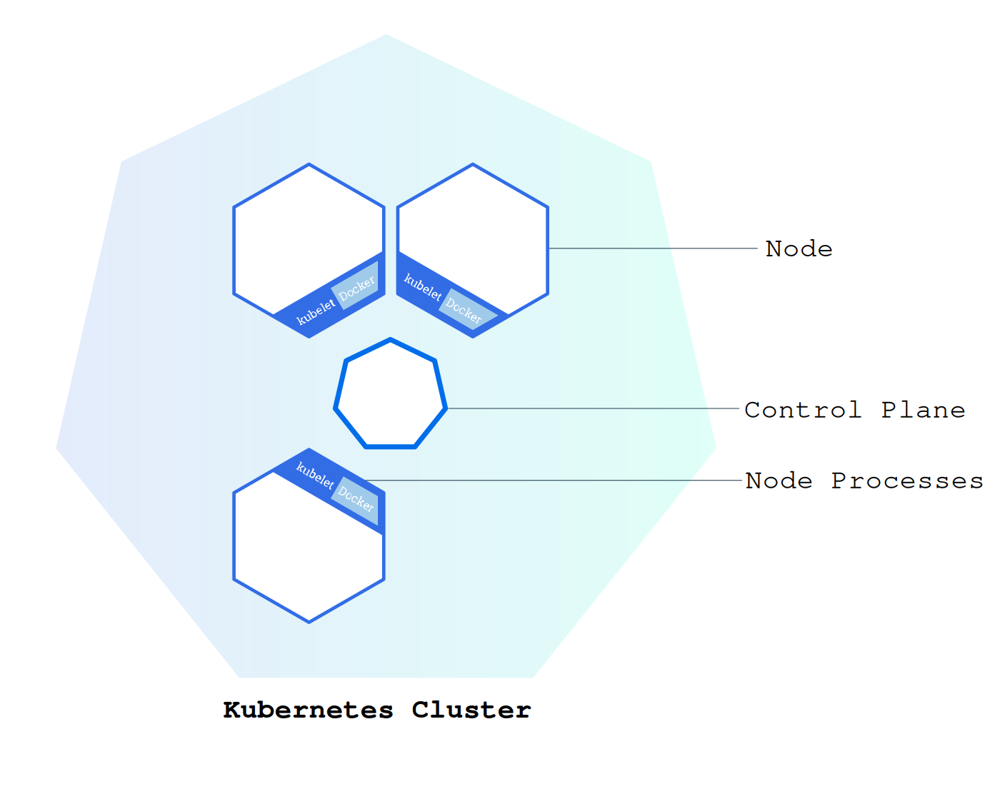

# Containerd and Kubernetes Installation

Step-by-step guide for setting up a Kubernetes cluster with **containerd** as the container runtime on Ubuntu-based systems.

Prerequisites: Ubuntu 22.04/24.04, root/sudo access, static IP on the control-plane node.

---




## 1. Disable swap

Kubernetes requires swap to be off for reliable scheduling and memory accounting.

```bash
sudo swapoff -a
sudo sed -i '/swap/d' /etc/fstab
```

---

## 2. Load kernel modules

```bash
cat <<EOF | sudo tee /etc/modules-load.d/containerd.conf
overlay
br_netfilter
EOF

sudo modprobe overlay
sudo modprobe br_netfilter
```

---

## 3. Enable IPv4 forwarding

```bash
sudo tee /etc/sysctl.d/99-kubernetes-cri.conf <<EOF
net.bridge.bridge-nf-call-iptables  = 1
net.ipv4.ip_forward                 = 1
net.bridge.bridge-nf-call-ip6tables = 1
EOF

sudo sysctl --system
```

---

## 4. Install and configure containerd

```bash
sudo apt-get update && sudo apt-get install -y containerd

sudo mkdir -p /etc/containerd
containerd config default | sudo tee /etc/containerd/config.toml

# Use systemd cgroup driver (required for kubeadm)
sudo sed -i 's/SystemdCgroup = false/SystemdCgroup = true/' /etc/containerd/config.toml

sudo systemctl restart containerd
sudo systemctl enable containerd
```

---

## 5. Install Kubernetes components

Replace `v1.30` with your target version from [pkgs.k8s.io](https://pkgs.k8s.io/).

```bash
sudo mkdir -p /etc/apt/keyrings
curl -fsSL https://pkgs.k8s.io/core:/stable:/v1.30/deb/Release.key \
  | sudo gpg --dearmor -o /etc/apt/keyrings/kubernetes-apt-keyring.gpg

echo "deb [signed-by=/etc/apt/keyrings/kubernetes-apt-keyring.gpg] https://pkgs.k8s.io/core:/stable:/v1.30/deb/ /" \
  | sudo tee /etc/apt/sources.list.d/kubernetes.list

sudo apt-get update
sudo apt-get install -y kubelet kubeadm kubectl
sudo apt-mark hold kubelet kubeadm kubectl
```

---

## 6. Enable kubelet

```bash
sudo systemctl enable --now kubelet
```

---

## 7. Initialize the control plane

Replace the IP addresses with your control-plane node IP.

```bash
sudo kubeadm init \
  --control-plane-endpoint 192.168.2.100 \
  --apiserver-advertise-address 192.168.2.100 \
  --pod-network-cidr 10.244.0.0/16 \
  | tee kubeadm-init.log
```

---

## 8. Configure kubectl

```bash
mkdir -p $HOME/.kube
sudo cp -i /etc/kubernetes/admin.conf $HOME/.kube/config
sudo chown $(id -u):$(id -g) $HOME/.kube/config
```

---

## 9. Join additional control-plane nodes

Upload certificates and generate a join command:

```bash
sudo kubeadm init phase upload-certs --upload-certs
```

Copy the certificate key from the output, then:

```bash
sudo kubeadm token create \
  --certificate-key <CERTIFICATE_KEY> \
  --print-join-command | tee cp-join-command.txt
```

Run the printed command on each additional control-plane node.

---

## 10. Join worker nodes

Use the `kubeadm join` command printed at the end of `kubeadm init` (also saved in `kubeadm-init.log`):

```bash
# Example — use the exact command from your init output
sudo kubeadm join 192.168.2.100:6443 \
  --token <token> \
  --discovery-token-ca-cert-hash sha256:<hash>
```

---

## 11. Install a CNI (pod network)

The cluster needs a CNI plugin before nodes become Ready. Example with Flannel:

```bash
kubectl apply -f https://github.com/flannel-io/flannel/releases/latest/download/kube-flannel.yml
```

Other options: Calico, Cilium, Weave Net.

---

## Verify

```bash
kubectl get nodes
kubectl get pods -A
```

All nodes should show `Ready`. Core system Pods (`kube-system`) should be `Running`.

**Next:** [03-kubectl-basics.md](./03-kubectl-basics.md) — shell completion, aliases, and context management.
