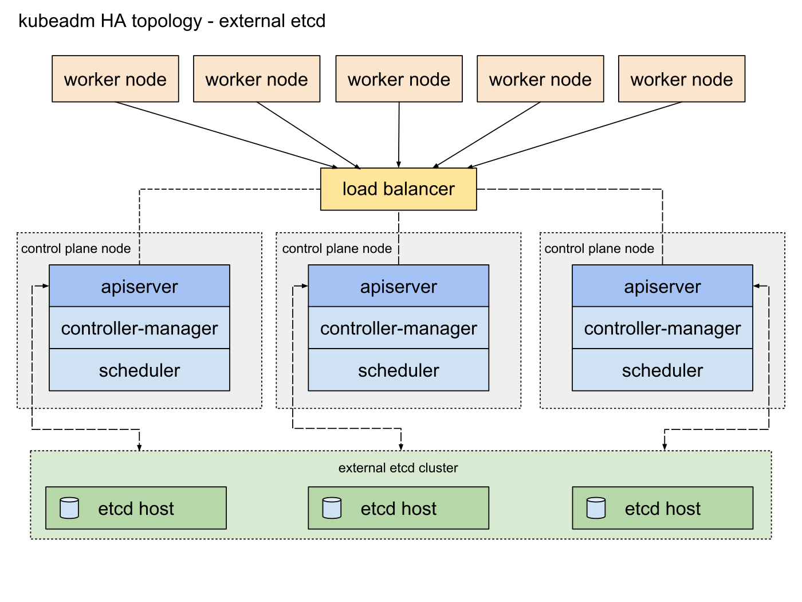

# 🛠️ Setting Up a High Availability etcd Cluster for Kubernetes

This guide walks you through installing a 3-node etcd cluster and using it as an **external HA datastore for Kubernetes**.

---




## 📦 Step 1: Install etcd

Download the etcd binary:

```bash
wget https://github.com/etcd-io/etcd/releases/download/v3.6.2/etcd-v3.6.2-linux-amd64.tar.gz
```

Extract it:

```bash
tar -xzvf etcd-v3.6.2-linux-amd64.tar.gz
```

Move binaries to the system path:

```bash
cp etcd-v3.6.2-linux-amd64/etcd* /usr/local/bin
```

Create the data directory:

```bash
mkdir -p /var/lib/etcd
```

---

## ⚙️ Step 2: Configure etcd Systemd Services

Create a systemd unit at `/etc/systemd/system/etcd.service`:

### Server 1 (`192.168.6.170`)

```ini
[Unit]
Description=etcd
After=network.target

[Service]
ExecStart=/usr/local/bin/etcd \
  --name etcd-1 \
  --listen-client-urls http://192.168.6.170:2379,http://127.0.0.1:2379 \
  --advertise-client-urls http://192.168.6.170:2379 \
  --initial-advertise-peer-urls http://192.168.6.170:2380 \
  --listen-peer-urls http://192.168.6.170:2380 \
  --initial-cluster-token etcd-cluster-1 \
  --initial-cluster etcd-1=http://192.168.6.170:2380,etcd-2=http://192.168.6.171:2380,etcd-3=http://192.168.6.172:2380 \
  --initial-cluster-state new \
  --data-dir /var/lib/etcd
Restart=always
User=root
StandardOutput=journal
StandardError=journal

[Install]
WantedBy=multi-user.target
```

### Server 2 (`192.168.6.171`)

```ini
[Unit]
Description=etcd
After=network.target

[Service]
ExecStart=/usr/local/bin/etcd \
  --name etcd-2 \
  --listen-client-urls http://192.168.6.171:2379,http://127.0.0.1:2379 \
  --advertise-client-urls http://192.168.6.171:2379 \
  --initial-advertise-peer-urls http://192.168.6.171:2380 \
  --listen-peer-urls http://192.168.6.171:2380 \
  --initial-cluster-token etcd-cluster-1 \
  --initial-cluster etcd-1=http://192.168.6.170:2380,etcd-2=http://192.168.6.171:2380,etcd-3=http://192.168.6.172:2380 \
  --initial-cluster-state new \
  --data-dir /var/lib/etcd
Restart=always
User=root
StandardOutput=journal
StandardError=journal

[Install]
WantedBy=multi-user.target
```

### Server 3 (`192.168.6.172`)

```ini
[Unit]
Description=etcd
After=network.target

[Service]
ExecStart=/usr/local/bin/etcd \
  --name etcd-3 \
  --listen-client-urls http://192.168.6.172:2379,http://127.0.0.1:2379 \
  --advertise-client-urls http://192.168.6.172:2379 \
  --initial-advertise-peer-urls http://192.168.6.172:2380 \
  --listen-peer-urls http://192.168.6.172:2380 \
  --initial-cluster-token etcd-cluster-1 \
  --initial-cluster etcd-1=http://192.168.6.170:2380,etcd-2=http://192.168.6.171:2380,etcd-3=http://192.168.6.172:2380 \
  --initial-cluster-state new \
  --data-dir /var/lib/etcd
Restart=always
User=root
StandardOutput=journal
StandardError=journal

[Install]
WantedBy=multi-user.target
```

---

## ▶️ Step 3: Start etcd Service

Enable and start etcd on **each server**:

```bash
sudo systemctl daemon-reload
sudo systemctl enable --now etcd
sudo systemctl status etcd
```

---

## ✅ Step 4: Verify etcd Cluster Health

Check endpoint health:

```bash
etcdctl --endpoints http://<IP>:2379 endpoint health
```

Check cluster membership:

```bash
etcdctl --endpoints http://<IP-SERVER-1>:2379 member list
```

If all members are healthy and visible, you're ready to move on.

---

## ☸️ Step 5: Install Kubernetes (Using External etcd)

Create a configuration file `config.yaml` on the **master node**:

```yaml
apiVersion: kubeadm.k8s.io/v1beta3
kind: ClusterConfiguration
etcd:
  external:
    endpoints:
    - http://192.168.6.170:2379
    - http://192.168.6.171:2379
    - http://192.168.6.172:2379

networking:
  podSubnet: 10.244.0.0/16
```

Initialize Kubernetes:

```bash
kubeadm init --config config.yaml
```

---

## 🎉 Done!

You now have a **Kubernetes cluster with external, high availability etcd**. :)

