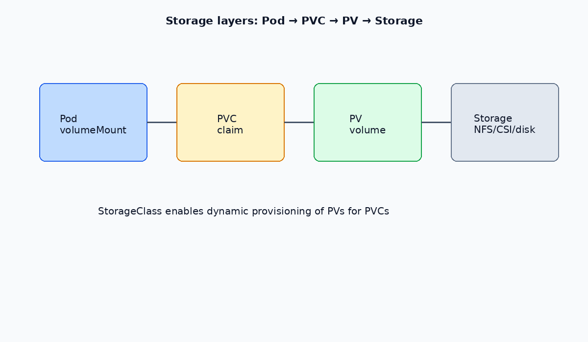

# Persistent Volumes and Persistent Volume Claims

A **PersistentVolume (PV)** is cluster storage provisioned by an administrator or dynamically via a **StorageClass**. A **PersistentVolumeClaim (PVC)** is a request for storage that binds to a matching PV.

```
PVC (request) → binds to → PV (actual storage) → mounted in Pod
```

---




## Storage layers

| Layer | Role |
| --- | --- |
| StorageClass | Defines how storage is provisioned (dynamic) |
| PV | The storage resource itself |
| PVC | User's request for capacity and access mode |
| Pod `volumeMount` | Attaches the PVC to a container |

---

## PV lifecycle

| State | Description |
| --- | --- |
| Available | Not bound to a claim |
| Bound | Bound to a PVC |
| Released | PVC deleted; reclaim policy applies |
| Failed | Automatic reclaim failed |

**Reclaim policies:** `Retain` (manual cleanup), `Delete` (remove storage), `Recycle` (deprecated — do not use).

---

## Access modes

| Mode | Abbreviation | Description |
| --- | --- | --- |
| ReadWriteOnce | RWO | Single node read/write |
| ReadOnlyMany | ROX | Many nodes read-only |
| ReadWriteMany | RWX | Many nodes read/write |
| ReadWriteOncePod | RWOP | Single Pod read/write (K8s 1.22+) |

---

## Commands

```bash
kubectl get pv
kubectl get pvc -A
kubectl describe pv <name>
kubectl describe pvc <name> -n <namespace>
```

---

## Example: NFS PersistentVolume

```yaml
apiVersion: v1
kind: PersistentVolume
metadata:
  name: pv-nfs
spec:
  capacity:
    storage: 5Gi
  volumeMode: Filesystem
  accessModes:
    - ReadWriteMany
  persistentVolumeReclaimPolicy: Retain
  storageClassName: nfs
  mountOptions:
    - hard
    - nfsvers=4.1
  nfs:
    path: /nfs/data
    server: 192.168.1.10
```

---

## Example: PVC and Deployment

```yaml
apiVersion: v1
kind: PersistentVolumeClaim
metadata:
  name: pvc-nginx-logs
  namespace: dev
spec:
  accessModes:
    - ReadWriteMany
  resources:
    requests:
      storage: 1Gi
  storageClassName: nfs
---
apiVersion: apps/v1
kind: Deployment
metadata:
  name: app-nginx
  namespace: dev
spec:
  replicas: 1
  selector:
    matchLabels:
      app: nginx
  template:
    metadata:
      labels:
        app: nginx
    spec:
      containers:
        - name: nginx
          image: nginx
          ports:
            - containerPort: 80
          volumeMounts:
            - name: nginx-log
              mountPath: /var/log/nginx
      volumes:
        - name: nginx-log
          persistentVolumeClaim:
            claimName: pvc-nginx-logs
```

> `volumes` belong under `spec` (Pod level), not inside the container definition. PVC `resources` only has `requests` — there is no `limits` field for storage claims.

---

## HostPath (development only)

HostPath mounts a directory from the node filesystem. Not portable across nodes — avoid in production.

```yaml
apiVersion: apps/v1
kind: Deployment
metadata:
  name: app-nginx
  namespace: dev
spec:
  replicas: 1
  selector:
    matchLabels:
      app: nginx
  template:
    metadata:
      labels:
        app: nginx
    spec:
      containers:
        - name: nginx
          image: nginx
          volumeMounts:
            - name: nginx-log
              mountPath: /var/log/nginx
      volumes:
        - name: nginx-log
          hostPath:
            path: /var/log/nginx
            type: DirectoryOrCreate
```

---

## Related

- [emptyDir volumes](./02-emptydir.md) — ephemeral Pod-local storage
- [Longhorn](./03-longhorn.md) — distributed block storage with dynamic provisioning
