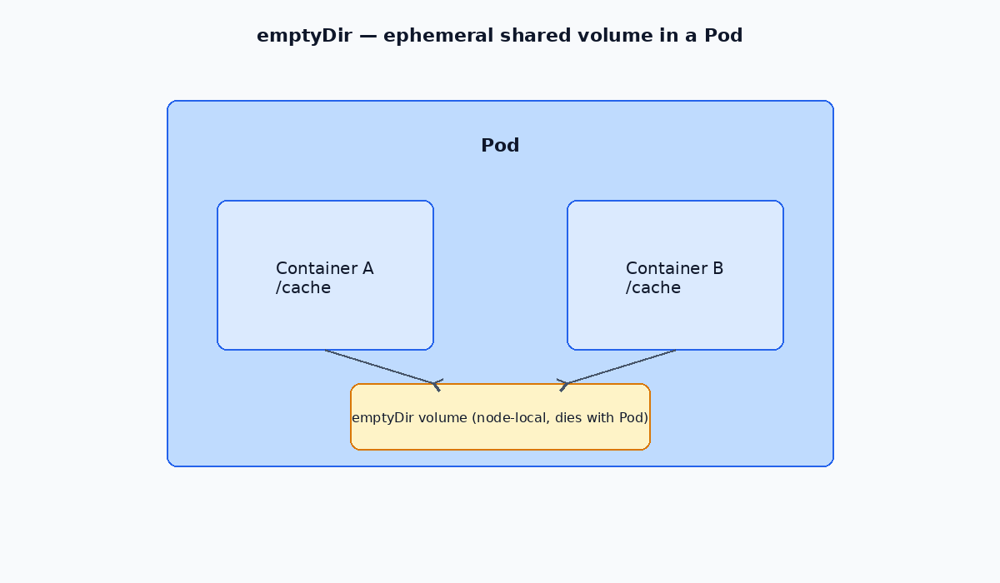

# emptyDir Volumes

Ephemeral storage that lives as long as the Pod exists. Data is deleted when the Pod is removed.

---




## How volumes work in Pods

- Volumes are defined at the **Pod** level, not inside individual containers.
- Containers access volumes through `volumeMounts` at a `mountPath`.
- `emptyDir` is created when the Pod starts and destroyed when the Pod is deleted.

---

## Visibility

- Pods **cannot** access another Pod's `emptyDir`.
- Containers **within the same Pod** can share an `emptyDir` volume.

---

## Example: memory-backed emptyDir

```yaml
apiVersion: v1
kind: Pod
metadata:
  name: pod-tests
  namespace: ns-test
spec:
  containers:
    - name: nginx
      image: nginx
      resources:
        limits:
          memory: 150Mi
          cpu: 500m
      volumeMounts:
        - name: nginx-log
          mountPath: /var/log/nginx
  volumes:
    - name: nginx-log
      emptyDir:
        medium: Memory
        sizeLimit: 64Mi
```

- `medium: Memory` stores data in tmpfs (RAM) for faster I/O.
- `sizeLimit` caps the volume size.

---

## When to use emptyDir

| Use case | Example |
| --- | --- |
| Scratch space | Sorting, temp files between init and app containers |
| Logs | Shared log directory between sidecar and main container |
| Cache | Short-lived cache that can be rebuilt |

For persistent data, use [PV/PVC](./01-pv-pvc.md) instead.
