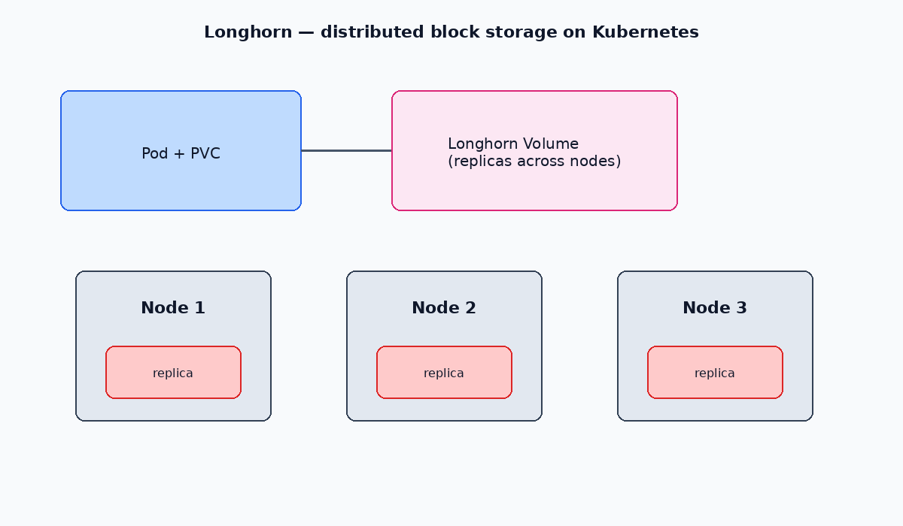

# Longhorn

**Longhorn** is distributed block storage for Kubernetes. It runs as a DaemonSet of engines/replicas on your nodes and provides a `longhorn` StorageClass for dynamic PVCs.

[← emptyDir](./02-emptydir.md) · [Kubernetes index](../README.md) · [PV / PVC](./01-pv-pvc.md)

---



## Prerequisites

- Kubernetes v1.21+ (check Longhorn release notes for your version)
- `kubectl` access and outbound HTTPS to pull images
- Open required ports between nodes (see [Longhorn networking](https://longhorn.io/docs/))
- Enough disk on nodes for replicas

---

## Install

```bash
kubectl apply -f https://raw.githubusercontent.com/longhorn/longhorn/v1.9.0/deploy/longhorn.yaml

kubectl get pods -n longhorn-system -w
kubectl get storageclass
```

Wait until Longhorn pods are `Running` / `Completed`. You should see StorageClass `longhorn`.

Optional UI (port-forward):

```bash
kubectl port-forward -n longhorn-system svc/longhorn-frontend 8080:80
# open http://127.0.0.1:8080
```

---

## Use with a PVC

```yaml
apiVersion: v1
kind: PersistentVolumeClaim
metadata:
  name: data
  namespace: ns
spec:
  accessModes:
    - ReadWriteOnce
  storageClassName: longhorn
  resources:
    requests:
      storage: 5Gi
---
apiVersion: v1
kind: Pod
metadata:
  name: app
  namespace: ns
spec:
  containers:
    - name: app
      image: busybox:1.36
      command: ["sleep", "3600"]
      volumeMounts:
        - name: data
          mountPath: /data
  volumes:
    - name: data
      persistentVolumeClaim:
        claimName: data
```

```bash
kubectl apply -f pvc-pod.yaml
kubectl get pvc,pv -n ns
```

StatefulSets often set `storageClassName: longhorn` on `volumeClaimTemplates` — see [StatefulSets](../workloads/17-statefulsets.md).

---

## Related

- [PV & PVC](./01-pv-pvc.md) — binding, access modes, reclaim policy
- [Official Longhorn docs](https://longhorn.io/docs/)
