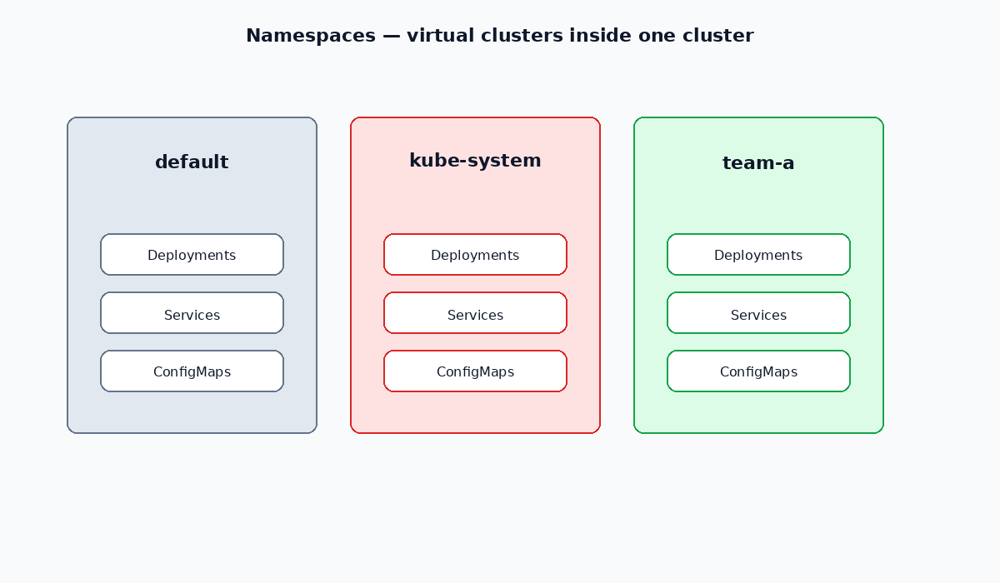

# Namespaces

Virtual clusters inside one physical cluster. Use them to isolate teams, environments, or apps (DNS, RBAC, quotas).

[← Kubernetes index](../README.md) · [Pods →](./02-pods.md)

---



## Built-in namespaces

| Namespace | Role |
| --- | --- |
| `default` | Default for resources with no namespace set |
| `kube-system` | Control-plane / system add-ons (CoreDNS, etc.) |
| `kube-public` | Readable by all users; rarely used for apps |
| `kube-node-lease` | Node heartbeat Lease objects |

Do **not** create namespaces that start with `kube-` — those are reserved for the system.

Namespaces isolate *names*, not network traffic. Pods in different namespaces can still talk unless you add NetworkPolicy.

---

## Commands

```bash
kubectl get namespaces
kubectl get ns

kubectl create namespace <name>
kubectl create ns <name>

kubectl delete ns <name>
```

Deleting a namespace deletes **all** namespaced resources inside it.

---

## Manifest

Example: [manifests/namespace.yaml](./manifests/namespace.yaml)

```yaml
apiVersion: v1
kind: Namespace
metadata:
  name: team-a
  labels:
    env: dev
```

```bash
kubectl apply -f manifests/namespace.yaml
```

Set the default namespace for your kubeconfig context:

```bash
kubectl config set-context --current --namespace=team-a
```

---

## Related

- [ResourceQuota](./12-resource-quota.md) — cap CPU/memory/object count per namespace
- [LimitRange](./16-limit-range.md) — default and max resources per Pod/container
