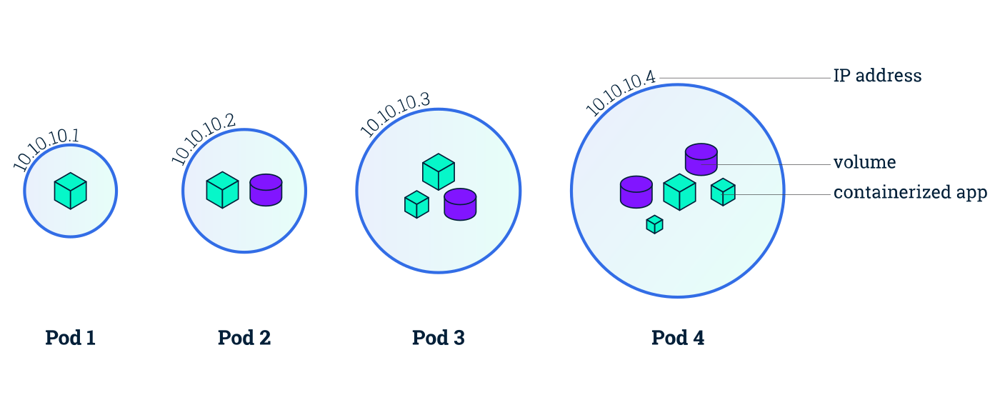

# Pods

The smallest deployable unit in Kubernetes. A Pod runs one or more containers that share network namespace and (optional) volumes.

Prefer a **Deployment** (or other controller) for real workloads. Create bare Pods mainly for debugging and learning.

[← Namespaces](./01-namespaces.md) · [Kubernetes index](../README.md) · [ReplicaSets →](./03-replicasets.md)

---



## Quick picture

```
Node
└── Pod (IP)
    ├── container A
    ├── container B (sidecar)
    └── volumes (emptyDir, PVC, …)
```

Containers in the same Pod share `localhost` and can use shared volumes. Each Pod gets its own cluster IP.

---

## Pod phases

| Phase | Meaning |
| --- | --- |
| `Pending` | Accepted, not running yet (scheduling, image pull, PVC) |
| `Running` | Bound to a node; at least one container is running |
| `Succeeded` | All containers exited 0 (Jobs) |
| `Failed` | All containers ended; at least one failed |
| `Unknown` | Node communication problem |

---

## Commands

```bash
# List
kubectl get pods
kubectl get pods -o wide
kubectl get pods -n <namespace>

# Run (quick test only)
kubectl run <name> --image=<image>
kubectl run <name> --image=<image> -n <namespace>

# Inspect
kubectl describe pod <name> -n <namespace>
kubectl logs -f <name> -n <namespace>
kubectl logs -f <name> -c <container> -n <namespace>

# Exec
kubectl exec -it <name> -n <namespace> -- /bin/sh

# Delete
kubectl delete pod <name> -n <namespace>
kubectl delete pod <name> -n <namespace> --force --grace-period=0
```

> Most Pod fields are immutable after creation. Prefer deleting/recreating, or change the owning Deployment/ReplicaSet. `kubectl edit pod` only works for a few mutable fields.

---

## Example manifest

Example: [manifests/pod.yaml](./manifests/pod.yaml)

```yaml
apiVersion: v1
kind: Pod
metadata:
  name: web
  namespace: dev
  labels:
    app: web
spec:
  containers:
    - name: nginx
      image: nginx:1.27
      ports:
        - containerPort: 80
      resources:
        requests:
          cpu: 100m
          memory: 128Mi
        limits:
          cpu: 250m
          memory: 256Mi
  nodeSelector:
    disktype: ssd
```

**Multi-container Pods** are for tightly coupled helpers (sidecars: log shipper, proxy). Unrelated apps should be separate Pods/Deployments.

---

## Related

- [Probes](./18-probes.md) — liveness / readiness / startup
- [Lifecycle hooks](./15-lifecycle-hooks.md) — `postStart` / `preStop`
- [Deployments](./04-deployments.md) — managed replicas and rollouts
- [Debugging](../operations/02-debugging.md) — logs, events, failure patterns
