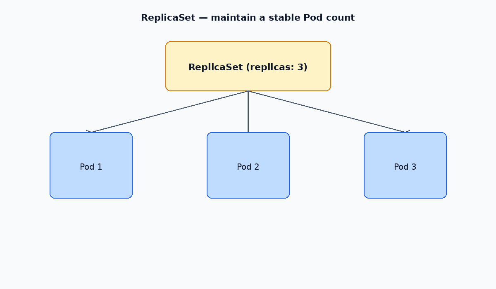

# ReplicaSets

A **ReplicaSet** keeps a stable number of identical Pods running. If a Pod dies, the ReplicaSet creates a replacement.

In practice you almost always use a **Deployment**, which owns ReplicaSets and adds rolling updates and rollbacks. Manage ReplicaSets directly only when debugging or learning.

[← Pods](./02-pods.md) · [Kubernetes index](../README.md) · [Deployments →](./04-deployments.md)

---



## Hierarchy

```
Deployment
  └── ReplicaSet (revision)
        └── Pods
```

Changing a Deployment’s Pod template creates a **new** ReplicaSet and scales the old one down.

---

## Commands

```bash
kubectl get rs -n <namespace>
kubectl get pods -n <namespace>
kubectl describe rs <name> -n <namespace>

kubectl scale rs <name> --replicas=3 -n <namespace>
kubectl edit rs <name> -n <namespace>
kubectl delete rs <name> -n <namespace>
```

> Editing the image on a ReplicaSet does **not** roll existing Pods. New Pods use the new template only after old Pods are deleted. Use a Deployment for image changes.

```bash
# Force recreate Pods matching a label (lab use)
kubectl delete pod -l app=web -n <namespace>
```

---

## Example manifest

Example: [manifests/replicaset.yaml](./manifests/replicaset.yaml)

```yaml
apiVersion: apps/v1
kind: ReplicaSet
metadata:
  name: web
  namespace: dev
spec:
  replicas: 3
  selector:
    matchLabels:
      app: web
  template:
    metadata:
      labels:
        app: web
    spec:
      containers:
        - name: nginx
          image: nginx:1.27
```

`spec.selector.matchLabels` must match `template.metadata.labels` exactly.

---

## Related

- [Deployments](./04-deployments.md) — preferred controller for stateless apps
- [Labels & selectors](../operations/04-labels.md)
