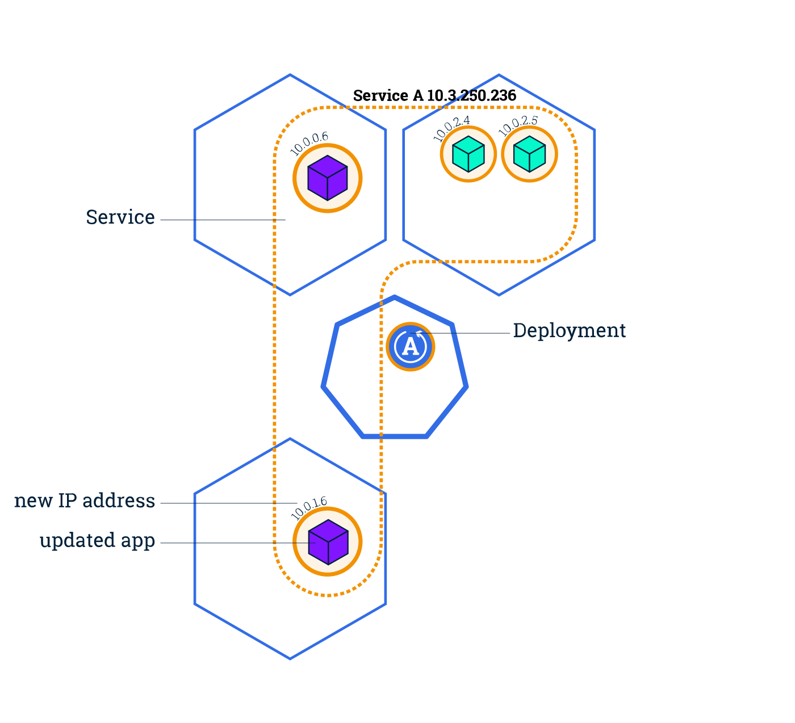
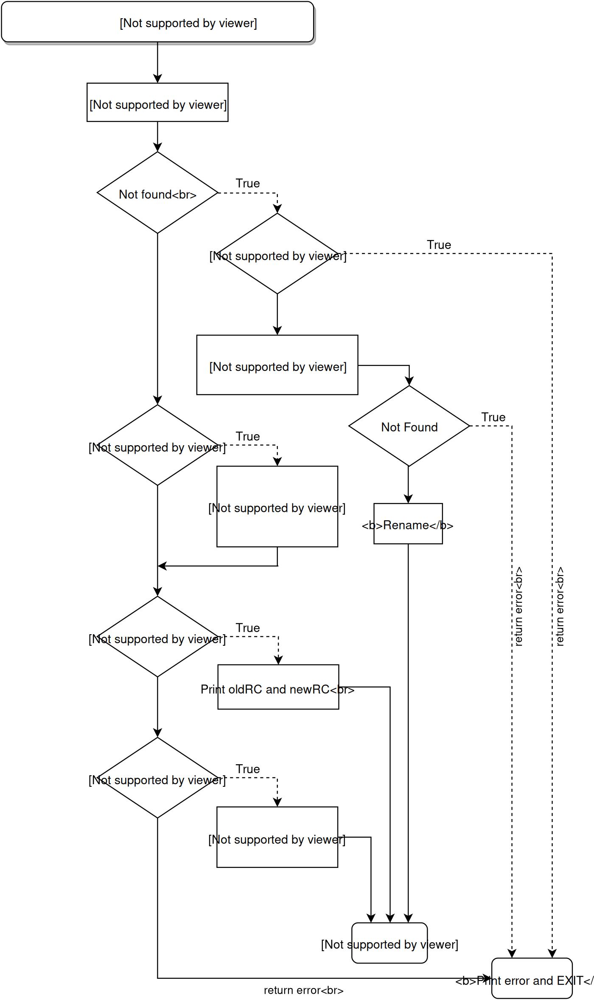

# 🚀 Kubernetes Deployment Management

A guide to managing **Deployments** in Kubernetes, including listing, editing, scaling, rollbacks, and version history.

---






## 📋 Listing & Editing Deployments

### 🔹 List Deployments in a Namespace

```bash
kubectl get deploy -n <namespace>
```

### 🔹 Edit a Deployment

```bash
kubectl edit deployment.apps -n <namespace> <deployment-name>
```

> 🛠️ **Note:**
> Unlike ReplicaSets, Deployments **automatically update** existing Pods when the image or spec is changed. This makes Deployments ideal for rolling updates and version control.

---

## 📈 Scaling a Deployment

Scale the number of replicas (Pods) for a Deployment:

```bash
kubectl scale -n <namespace> deployment <deployment-name> --replicas=<number>
```

---

## 🔁 Rollout Management

### 🔹 View Rollout History

```bash
kubectl rollout history deployment -n <namespace> <deployment-name>
```

### 🔹 View Specific Revision

```bash
kubectl rollout history deployment -n <namespace> <deployment-name> --revision=<revision-number>
```

### 🔹 Roll Back to a Previous Revision

```bash
kubectl rollout undo deployment -n <namespace> <deployment-name> --to-revision=<revision-number>
```

> ✅ **Tip:**
> Deployments maintain revision history. This allows you to **roll back to a previous working version** in case of failure.

---

## 🧾 Example Deployment YAML

```yaml
apiVersion: apps/v1
kind: Deployment
metadata:
  name: app-1
  namespace: dev
  labels:
    label1: test1
    app.kubernetes.io/label2: test2
spec:
  replicas: 3
  selector:
    matchLabels:
      app.kubernetes.io/label2: test2
  template:
    metadata:
      labels:
        app.kubernetes.io/label2: test2
        os: linux
    spec:
      containers:
        - name: nginx
          image: nginx
```

> 🎯 **Why use Deployments?**
> They offer:

* Rolling updates
* Rollbacks
* Declarative Pod management
* History tracking

---

## ✅ Summary

| Feature          | Pod | ReplicaSet | Deployment |
| ---------------- | --- | ---------- | ---------- |
| Manual creation  | ✅   | 🚫         | 🚫         |
| Scales Pods      | ❌   | ✅          | ✅          |
| Self-healing     | ❌   | ✅          | ✅          |
| Rolling updates  | ❌   | ❌          | ✅          |
| Revision history | ❌   | ❌          | ✅          |

