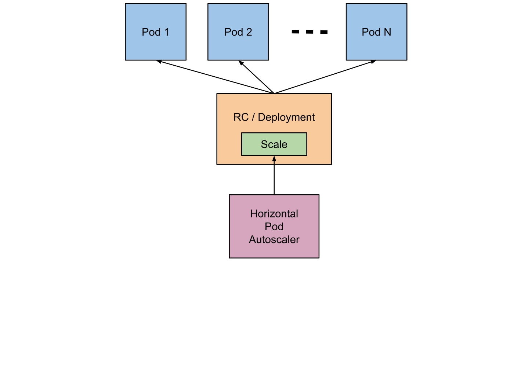

# Horizontal Pod Autoscaler (HPA)

The Horizontal Pod Autoscaler automatically adjusts the replica count of a Deployment (or StatefulSet) based on observed metrics — typically CPU or memory utilization.

**Requirements:**

- Metrics Server must be installed in the cluster.
- Containers must define `resources.requests` (HPA needs a baseline to calculate utilization).

```bash
kubectl apply -f https://github.com/kubernetes-sigs/metrics-server/releases/latest/download/components.yaml
```

---




## Commands

### Create an HPA

```bash
kubectl autoscale deployment <deployment-name> \
  --cpu-percent=50 \
  --min=2 \
  --max=10 \
  -n <namespace>
```

### Inspect and manage

```bash
kubectl get hpa -n <namespace>
kubectl describe hpa <hpa-name> -n <namespace>
kubectl edit hpa <hpa-name> -n <namespace>
kubectl delete hpa <hpa-name> -n <namespace>
```

---

## Example manifest

```yaml
apiVersion: autoscaling/v2
kind: HorizontalPodAutoscaler
metadata:
  name: hpa-nginx
  namespace: dev
spec:
  scaleTargetRef:
    apiVersion: apps/v1
    kind: Deployment
    name: nginx-deployment
  minReplicas: 2
  maxReplicas: 10
  metrics:
    - type: Resource
      resource:
        name: cpu
        target:
          type: Utilization
          averageUtilization: 50
```

Apply:

```bash
kubectl apply -f hpa.yaml
```

---

## How it works

1. Metrics Server collects Pod CPU/memory usage.
2. HPA controller compares usage against the target (e.g. 50% of requested CPU).
3. If above target, HPA increases replicas (up to `maxReplicas`).
4. If below target, HPA decreases replicas (down to `minReplicas`).

Scale-down has a cooldown period to avoid flapping.

---

## Troubleshooting

```bash
kubectl describe hpa <name> -n <namespace>   # check Conditions and Events
kubectl top pods -n <namespace>              # current usage
```

| Issue | Fix |
| --- | --- |
| `unknown` metrics | Install or fix Metrics Server |
| HPA never scales | Pods missing `resources.requests` |
| Scales too aggressively | Lower target utilization or adjust cooldown |
