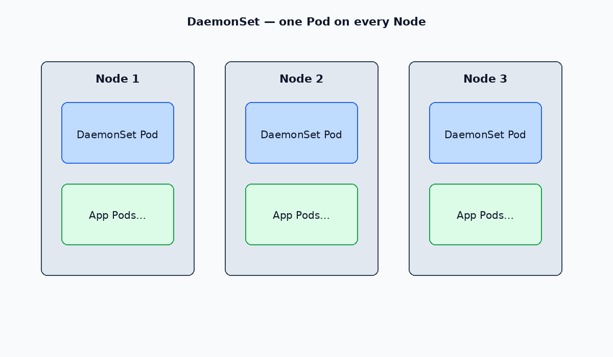

# DaemonSets

A **DaemonSet** ensures a copy of a Pod runs on every (or selected) node. Used for node-level agents: logging, metrics, CNI, storage daemons.

When a node joins the cluster, the DaemonSet controller adds a Pod. When a node leaves, that Pod is garbage-collected.

[← HPA](./05-hpa.md) · [Kubernetes index](../README.md) · [Jobs →](./07-jobs.md)

---



## When to use

| Use DaemonSet | Use Deployment |
| --- | --- |
| Must run on every node | Stateless app replicas |
| Needs host network / hostPath | Horizontal scale by load |
| Log / metrics / device plugins | Web APIs, workers |

DaemonSet Pods are **not** scheduled by the default scheduler the same way Deployments are — they are bound to nodes by the DaemonSet controller (subject to tolerations / node selectors).

---

## Commands

```bash
kubectl get ds -n <namespace>
kubectl describe ds <name> -n <namespace>
kubectl rollout status ds/<name> -n <namespace>
kubectl delete ds <name> -n <namespace>
```

---

## Update strategy

| Strategy | Behavior |
| --- | --- |
| `RollingUpdate` (default) | Replace Pods gradually (`maxUnavailable`) |
| `OnDelete` | Update only after you delete Pods manually |

---

## Example manifest

Example: [manifests/daemonset.yaml](./manifests/daemonset.yaml)

```yaml
apiVersion: apps/v1
kind: DaemonSet
metadata:
  name: node-agent
  namespace: monitoring
  labels:
    app: node-agent
spec:
  selector:
    matchLabels:
      app: node-agent
  template:
    metadata:
      labels:
        app: node-agent
    spec:
      tolerations:
        - key: node-role.kubernetes.io/control-plane
          operator: Exists
          effect: NoSchedule
      containers:
        - name: agent
          image: busybox:1.36
          command: ["/bin/sh", "-c", "while true; do sleep 3600; done"]
```

Add `nodeSelector` or `affinity` to run only on a subset of nodes (for example `disktype=ssd`).

---

## Related

- [Node management](../operations/03-node-management.md) — drain ignores DaemonSet Pods by default with `--ignore-daemonsets`
- [Labels](../operations/04-labels.md)
