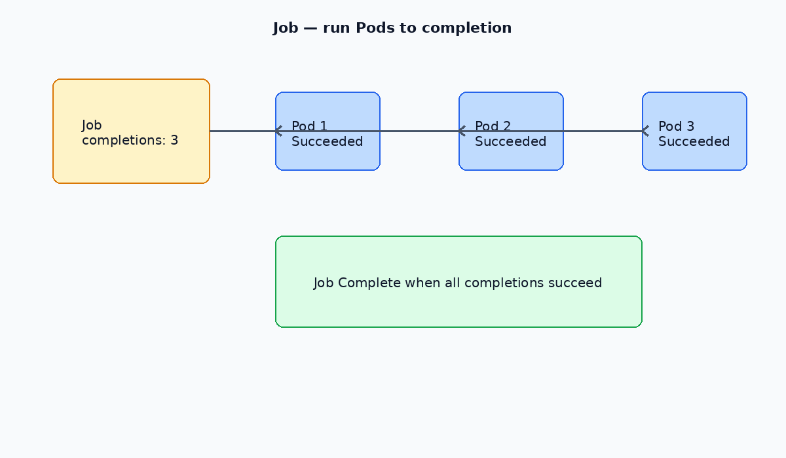

# Jobs

A **Job** creates one or more Pods and retries until a specified number succeed. Use Jobs for batch work: backups, migrations, reports — anything that should run **to completion**.

[← DaemonSets](./06-daemonsets.md) · [Kubernetes index](../README.md) · [CronJobs →](./08-cronjobs.md)

---



## Key fields

| Field | Meaning |
| --- | --- |
| `completions` | How many successful Pods before the Job is done (default 1) |
| `parallelism` | How many Pods may run at once |
| `backoffLimit` | Retries before the Job is marked Failed (default 6) |
| `activeDeadlineSeconds` | Hard time limit for the whole Job |
| `ttlSecondsAfterFinished` | Auto-cleanup finished Jobs |

Pod `restartPolicy` must be `Never` or `OnFailure` (not `Always`).

---

## Commands

```bash
kubectl get jobs -n <namespace>
kubectl describe job <name> -n <namespace>
kubectl logs job/<name> -n <namespace>
kubectl delete job <name> -n <namespace>
```

Deleting a Job also deletes its Pods (unless you use orphan cascading — rarely needed).

---

## Example manifest

Example: [manifests/job.yaml](./manifests/job.yaml)

```yaml
apiVersion: batch/v1
kind: Job
metadata:
  name: hello
  namespace: ns
spec:
  completions: 1
  parallelism: 1
  backoffLimit: 3
  template:
    spec:
      restartPolicy: Never
      containers:
        - name: hello
          image: busybox:1.36
          command: ["/bin/sh", "-c", "echo hello world"]
```

Parallel example: `completions: 5`, `parallelism: 2` runs up to two Pods at a time until five succeed.

---

## Related

- [CronJobs](./08-cronjobs.md) — schedule Jobs on a timetable
- [Debugging](../operations/02-debugging.md)
