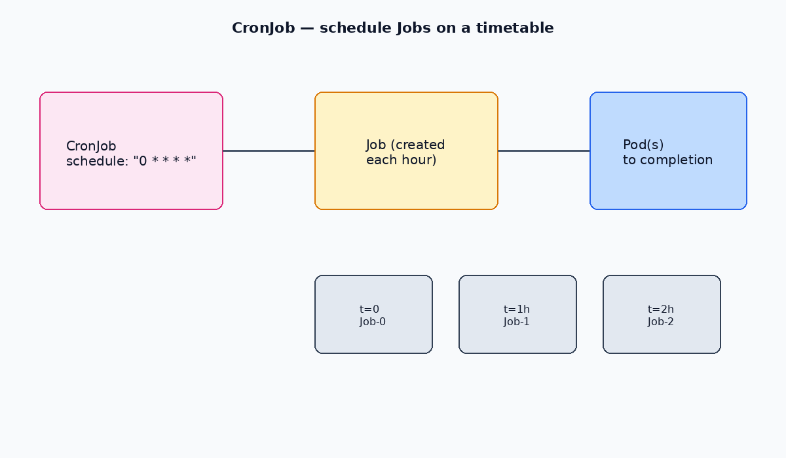

# ⏰ Kubernetes CronJobs

A **CronJob** in Kubernetes allows you to run jobs on a recurring schedule, similar to traditional UNIX `cron` jobs. Ideal for periodic tasks like backups, reports, or scheduled notifications.

---




## 🔍 CronJob Commands

### 📄 List CronJobs in a Namespace
```bash
kubectl get cronjobs.batch -n <namespace>
```

### ❌ Delete a CronJob

```bash
kubectl delete cronjobs.batch -n <namespace> <cronjob-name>
```

---

## 🧾 Example CronJob Manifest

This CronJob runs every minute and prints the date followed by "Kubernetes":

```yaml
apiVersion: batch/v1
kind: CronJob
metadata:
  name: cronjob1
  namespace: ns
spec:
  schedule: "* * * * *"
  jobTemplate:
    spec:
      template:
        spec:
          containers:
            - name: cronjob
              image: debian:bookworm
              command:
                - /bin/bash
                - -c
                - date; echo Kubernetes
          restartPolicy: Never
```

> The `schedule` field uses standard cron syntax: `minute hour day-of-month month day-of-week`.
> Test schedules carefully — `* * * * *` runs every minute.

