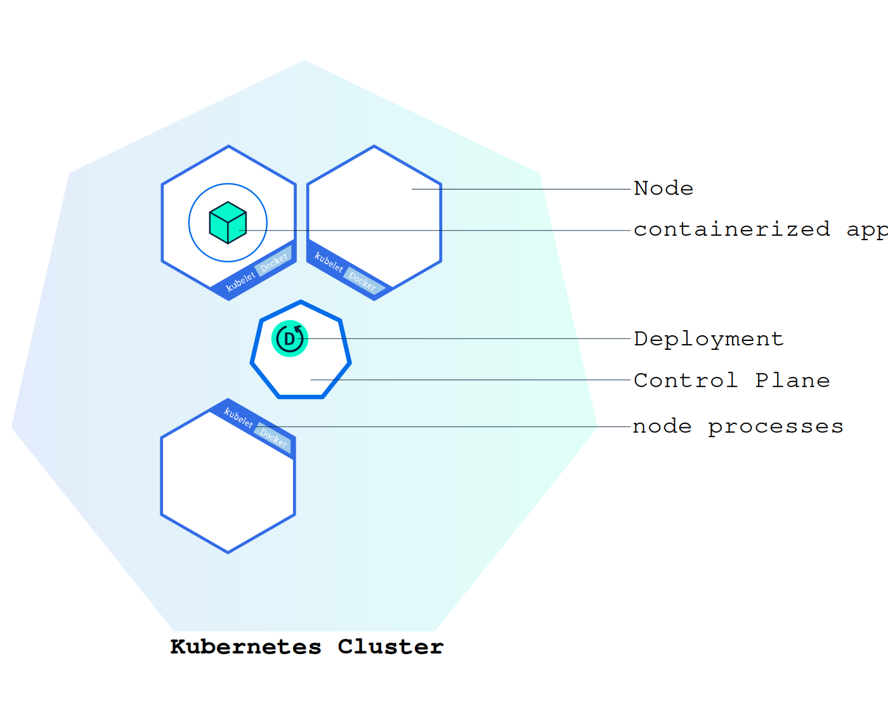

# Deployment with Service — Walkthrough

One manifest creates a namespace, a Deployment, and a ClusterIP Service. The Service sends traffic on port **80** to nginx containers listening on port **80**.

Full file: [manifests/deployment-with-service.yaml](./manifests/deployment-with-service.yaml)

[← Services](./09-services.md) · [Kubernetes index](../README.md) · [ConfigMaps →](./11-configmaps.md)

---



```bash
kubectl apply -f manifests/deployment-with-service.yaml
kubectl get all -n ns
```

---

## 1. Namespace

```yaml
apiVersion: v1
kind: Namespace
metadata:
  name: ns
```

Isolates this example under `ns`.

---

## 2. Service

```yaml
apiVersion: v1
kind: Service
metadata:
  name: nginx-service
  namespace: ns
  labels:
    app: nginx
spec:
  type: ClusterIP
  selector:
    app: nginx
  ports:
    - name: http
      port: 80
      targetPort: 80
```

- `selector.app: nginx` must match Pod labels from the Deployment.
- `port: 80` is what clients use (`nginx-service.ns.svc.cluster.local`).
- `targetPort: 80` is the container port (`nginx:latest` listens on 80).

---

## 3. Deployment

```yaml
apiVersion: apps/v1
kind: Deployment
metadata:
  name: nginx-deployment
  namespace: ns
  labels:
    app: nginx
spec:
  replicas: 2
  selector:
    matchLabels:
      app: nginx
  template:
    metadata:
      labels:
        app: nginx
    spec:
      containers:
        - name: nginx
          image: nginx:1.27
          ports:
            - containerPort: 80
          resources:
            requests:
              cpu: 100m
              memory: 128Mi
            limits:
              cpu: 250m
              memory: 256Mi
```

- `replicas: 2` keeps two Pods; the ReplicaSet recreates failures.
- Resource `requests` affect scheduling; `limits` cap usage.

---

## Verify

```bash
kubectl get pods,svc,ep -n ns

# Local access
kubectl port-forward -n ns svc/nginx-service 8080:80
# curl http://127.0.0.1:8080/

# From another Pod
kubectl run curl --rm -it --image=curlimages/curl -n ns -- \
  curl -sS http://nginx-service/
```

Cleanup:

```bash
kubectl delete -f manifests/deployment-with-service.yaml
```

---

## Related

- [Services](./09-services.md)
- [Deployments](./04-deployments.md)
- [Ingress](./14-ingress.md)
