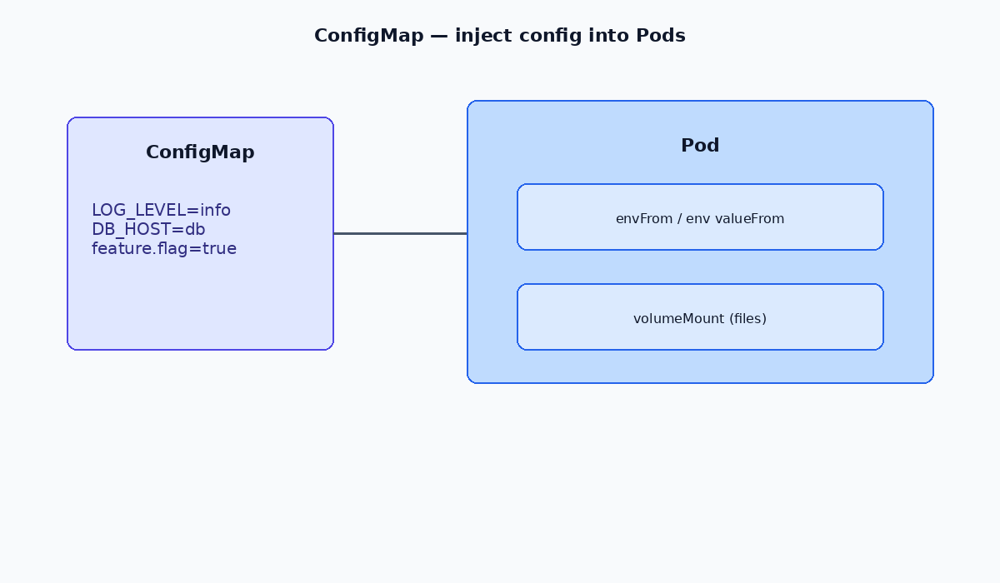

# 🧾 Kubernetes ConfigMap Guide

Manage configuration without hardcoding! `ConfigMaps` let you store external configurations as key-value pairs and inject them into Kubernetes workloads.

---




## 📘 What is a ConfigMap?

A **ConfigMap** is a Kubernetes object used to store **non-confidential configuration data** in **key-value** format. You can:

* 📄 Mount it as files inside a Pod
* 🌿 Use it as environment variables
* 🧩 Keep your container images decoupled from configuration

---

## ⚙️ Creating a ConfigMap

You can create a ConfigMap from files or directories:

```bash
kubectl -n <namespace> create configmap <configmap-name> --from-file=<file-or-directory>
```

### ✅ Examples

```bash
# From a single file
kubectl -n <ns> create configmap nginx-conf --from-file=./nginx.conf

# From multiple files
kubectl -n <ns> create configmap nginx-conf \
  --from-file=./nginx.conf \
  --from-file=./site.conf
```

---

## 📂 Viewing & Editing ConfigMaps

```bash
# List all ConfigMaps in a namespace
kubectl get cm -n <namespace>

# View detailed ConfigMap info
kubectl describe configmap <name> -n <namespace>

# Edit in-place
kubectl -n <namespace> edit configmap <configmap-name>
```

---

## 📄 YAML: ConfigMap Example

```yaml
apiVersion: v1
kind: ConfigMap
metadata:
  name: game-demo
data:
  player_initial_lives: "3"
  ui_properties_file_name: "user-interface.properties"

  game.properties: |
    enemy.types=aliens,monsters
    player.maximum-lives=5    

  user-interface.properties: |
    color.good=purple
    color.bad=yellow
    allow.textmode=true    
```

---

## 💡 Usage Examples

### 📌 ConfigMap as Environment Variables

**ConfigMap:**

```yaml
apiVersion: v1
kind: ConfigMap
metadata:
  name: app-config
  namespace: default
data:
  APP_MODE: "production"
  LOG_LEVEL: "info"
  FEATURE_FLAG_X: "enabled"
```

**Pod:**

```yaml
apiVersion: v1
kind: Pod
metadata:
  name: my-app
spec:
  containers:
    - name: my-container
      image: busybox
      command: ["/bin/sh", "-c", "env && sleep 3600"]
      envFrom:
        - configMapRef:
            name: app-config
```

---

### 🧾 Mounting ConfigMap as a File (nginx.conf example)

**ConfigMap:**

```yaml
apiVersion: v1
kind: ConfigMap
metadata:
  name: nginx-config
  namespace: default
data:
  nginx.conf: |
    worker_processes  1;

    events {
        worker_connections  1024;
    }

    http {
        include       mime.types;
        default_type  application/octet-stream;

        sendfile        on;
        keepalive_timeout  65;

        server {
            listen       80;
            server_name  localhost;

            location / {
                root   /usr/share/nginx/html;
                index  index.html index.htm;
            }

            error_page   500 502 503 504  /50x.html;
            location = /50x.html {
                root   /usr/share/nginx/html;
            }
        }
    }
```

**Pod:**

```yaml
apiVersion: v1
kind: Pod
metadata:
  name: nginx-pod
spec:
  containers:
    - name: nginx
      image: nginx:latest
      volumeMounts:
        - name: nginx-config-volume
          mountPath: /etc/nginx/nginx.conf
          subPath: nginx.conf
  volumes:
    - name: nginx-config-volume
      configMap:
        name: nginx-config
```

---

## 🛠 Pro Tips

* 🔐 For **sensitive data**, use **Secrets** instead of ConfigMaps.
* 🧪 Combine ConfigMaps with **Deployment** objects for flexible, versioned config management.
* 📦 Use `--from-env-file` to load multiple key-value pairs from a `.env` style file:

  ```bash
  kubectl create configmap my-config --from-env-file=env.list
  ```

