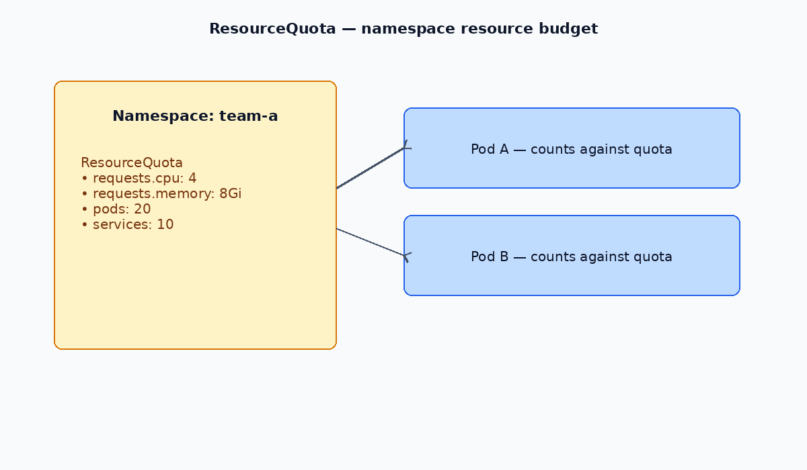

# ResourceQuota

Limits total resource consumption and object counts within a namespace. Pair with [LimitRange](./16-limit-range.md) for per-Pod defaults and caps.

[← ConfigMaps](./11-configmaps.md) · [Kubernetes index](../README.md) · [Secrets →](./13-secrets.md)

---



## Commands

```bash
# List quotas in a namespace
kubectl get resourcequota -n <namespace>

# Inspect details
kubectl describe resourcequota <name> -n <namespace>
```

---

## Example manifest

```yaml
apiVersion: v1
kind: ResourceQuota
metadata:
  name: dev-quota
  namespace: dev
spec:
  hard:
    pods: "10"
    requests.cpu: "1"
    requests.memory: 1Gi
    limits.cpu: "2"
    limits.memory: 2Gi
    services: "5"
    configmaps: "10"
    secrets: "10"
    persistentvolumeclaims: "4"
```

Apply:

```bash
kubectl apply -f resourcequota.yaml
```

---

## Common `hard` keys

| Key | Limits |
| --- | --- |
| `pods` | Total number of Pods |
| `requests.cpu` / `limits.cpu` | Aggregate CPU across the namespace |
| `requests.memory` / `limits.memory` | Aggregate memory across the namespace |
| `services` | Number of Services |
| `persistentvolumeclaims` | Number of PVCs |
| `configmaps` / `secrets` | Number of ConfigMaps / Secrets |

---

## ResourceQuota vs LimitRange

| | ResourceQuota | LimitRange |
| --- | --- | --- |
| Scope | Entire namespace | Individual Pod or container |
| Purpose | Cap total usage | Enforce defaults and min/max per workload |

Use both: LimitRange keeps individual workloads sane; ResourceQuota prevents one namespace from consuming the whole cluster.
