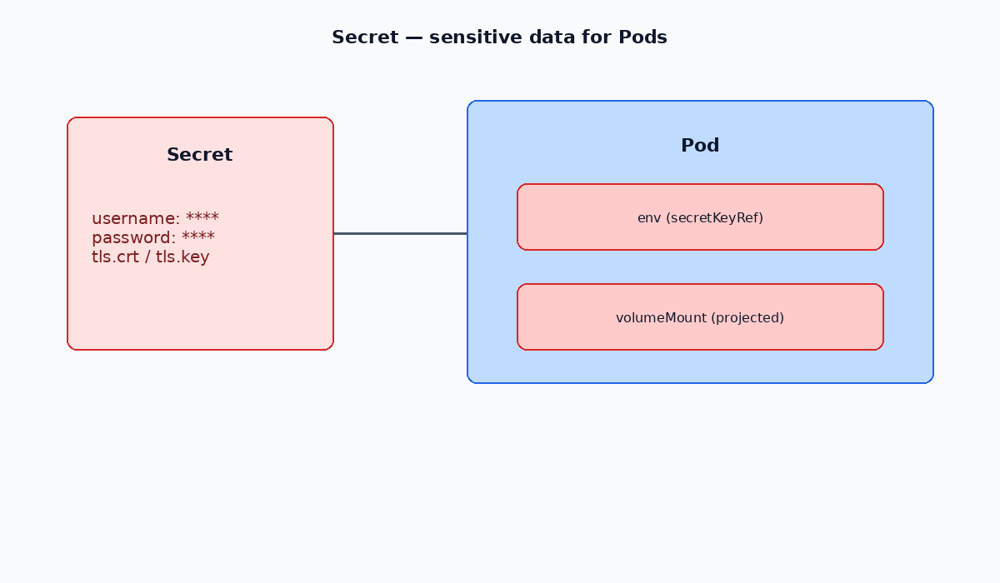

# 🔐 Kubernetes Secrets Guide

Kubernetes **Secrets** are used to store and manage sensitive information such as passwords, OAuth tokens, and SSH keys. Unlike ConfigMaps, they are specifically designed for confidential data.

---




## 📌 Types of Kubernetes Secrets

| **Built-in Type**                     | **Usage**                               |
| ------------------------------------- | --------------------------------------- |
| `Opaque`                              | Arbitrary user-defined data             |
| `kubernetes.io/service-account-token` | ServiceAccount token                    |
| `kubernetes.io/dockercfg`             | Serialized `~/.dockercfg` file          |
| `kubernetes.io/dockerconfigjson`      | Serialized `~/.docker/config.json` file |
| `kubernetes.io/basic-auth`            | Credentials for basic authentication    |
| `kubernetes.io/ssh-auth`              | Credentials for SSH authentication      |
| `kubernetes.io/tls`                   | Data for a TLS client or server         |
| `bootstrap.kubernetes.io/token`       | Bootstrap token data                    |

---

## 📂 Creating a Secret

You can create a Secret directly with `kubectl`:

```bash
kubectl create secret generic db-pass --from-literal=password='123'
```

Verify it exists:

```bash
kubectl get secret db-pass
```

---

## 📜 Secret YAML Example

```yaml
apiVersion: v1
kind: Secret
metadata:
  name: db-pass
type: Opaque
stringData:
  password: '123'
```

---

## 🚀 Using a Secret in a Pod

Secrets can be injected into a Pod as **environment variables**:

```yaml
apiVersion: v1
kind: Pod
metadata:
  name: mariadb-db
spec:
  containers:
    - name: mariadb
      image: mariadb
      env:
        - name: MARIADB_ROOT_PASSWORD
          valueFrom:
            secretKeyRef:
              name: db-pass
              key: password
```

This example sets the MariaDB root password from the `db-pass` Secret.

---

✅ **Tip:** Use `stringData` for plaintext values in YAML (Kubernetes encodes them automatically), or `data` with base64-encoded values. Never commit real secrets to version control.

