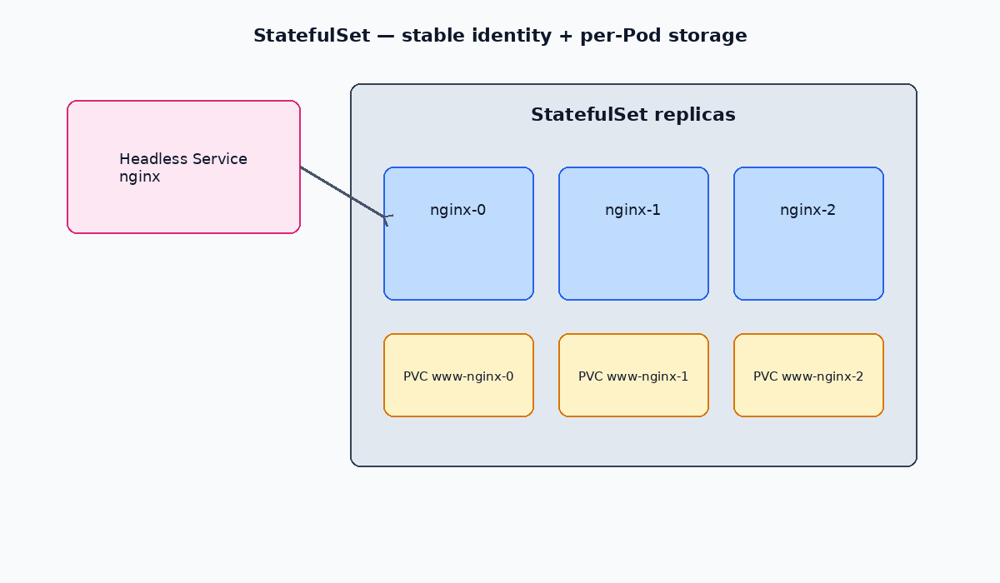

# StatefulSets

A **StatefulSet** runs Pods with stable identity: predictable names (`web-0`, `web-1`), stable DNS via a **headless Service**, and optional per-Pod storage (`volumeClaimTemplates`).

Use for databases, queues, and anything that needs sticky identity or disk.

[← LimitRange](./16-limit-range.md) · [Kubernetes index](../README.md) · [Probes →](./18-probes.md)

---



## Vs Deployment

| | Deployment | StatefulSet |
| --- | --- | --- |
| Pod names | Random suffix | Ordinal: `name-0`, `name-1`, … |
| Network ID | Ephemeral | Stable DNS per Pod |
| Storage | Shared claim or none | Often one PVC per Pod |
| Scale down | Arbitrary Pod | Highest ordinal first |
| Updates | Parallel rolling | Ordered (by default) |

---

## Headless Service

StatefulSets need a Service with `clusterIP: None`. DNS then resolves each Pod:

```
<pod-name>.<service-name>.<namespace>.svc.cluster.local
```

Example: `nginx-0.nginx.ns.svc.cluster.local`

---

## Commands

```bash
kubectl get sts -n <namespace>
kubectl describe sts <name> -n <namespace>
kubectl scale sts <name> --replicas=3 -n <namespace>
kubectl delete sts <name> -n <namespace>
# PVCs from volumeClaimTemplates are kept by default — delete them separately if needed
kubectl get pvc -n <namespace>
```

---

## Example manifest

Example: [manifests/statefulset.yaml](./manifests/statefulset.yaml)

```yaml
apiVersion: v1
kind: Service
metadata:
  name: nginx
  labels:
    app: nginx
spec:
  clusterIP: None
  selector:
    app: nginx
  ports:
    - name: web
      port: 80
---
apiVersion: apps/v1
kind: StatefulSet
metadata:
  name: nginx
spec:
  serviceName: nginx
  replicas: 3
  selector:
    matchLabels:
      app: nginx
  template:
    metadata:
      labels:
        app: nginx
    spec:
      containers:
        - name: nginx
          image: nginx:1.27
          ports:
            - containerPort: 80
              name: web
          volumeMounts:
            - name: www
              mountPath: /usr/share/nginx/html
  volumeClaimTemplates:
    - metadata:
        name: www
      spec:
        accessModes: ["ReadWriteOnce"]
        storageClassName: longhorn
        resources:
          requests:
            storage: 1Gi
```

Requires a working StorageClass (for example [Longhorn](../storage/03-longhorn.md)). Change `storageClassName` to match your cluster.

---

## Related

- [Services](./09-services.md) — headless Services
- [PV & PVC](../storage/01-pv-pvc.md)
- [Longhorn](../storage/03-longhorn.md)
