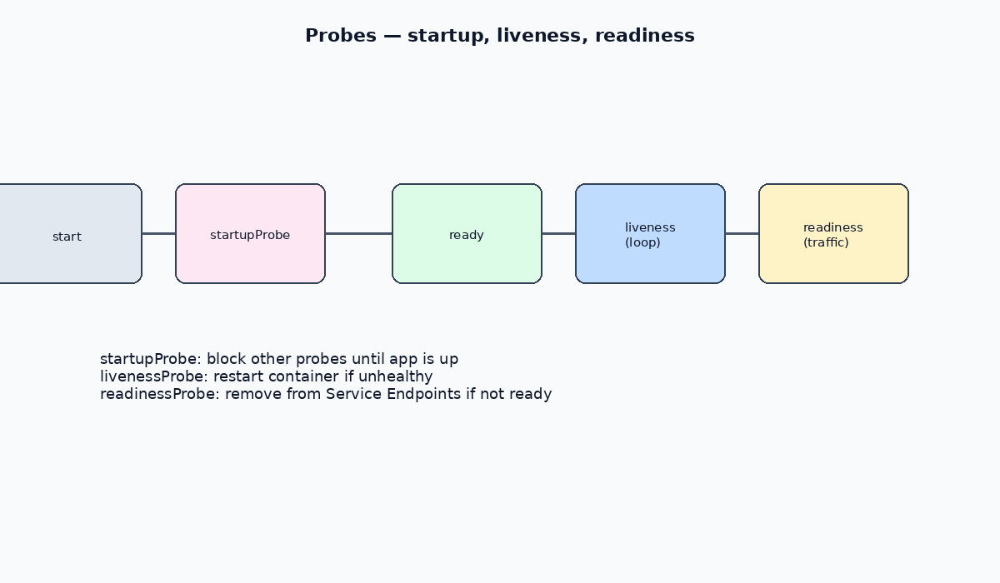

# Probes

Probes tell kubelet whether a container is alive, ready for traffic, or still starting. Misconfigured probes cause restarts (`CrashLoopBackOff`) or empty Service Endpoints.

[← StatefulSets](./17-statefulsets.md) · [Kubernetes index](../README.md) · [Lifecycle hooks](./15-lifecycle-hooks.md)

---



## Types

| Probe | Purpose | On failure |
| --- | --- | --- |
| `startupProbe` | App still booting | Block liveness/readiness until success (or restart after failures) |
| `livenessProbe` | Process is healthy | Container restarted |
| `readinessProbe` | Ready for traffic | Pod removed from Service Endpoints |

Prefer **startupProbe** for slow apps instead of a long liveness `initialDelaySeconds`.

---

## Probe mechanisms

| Handler | How |
| --- | --- |
| `httpGet` | HTTP GET to path/port; status 200–399 = success |
| `tcpSocket` | TCP connect to port |
| `exec` | Run command in container; exit 0 = success |
| `grpc` | gRPC health check (supported versions) |

Common timing fields: `initialDelaySeconds`, `periodSeconds`, `timeoutSeconds`, `failureThreshold`, `successThreshold`.

---

## Example

```yaml
apiVersion: apps/v1
kind: Deployment
metadata:
  name: web
  namespace: ns
spec:
  replicas: 2
  selector:
    matchLabels:
      app: web
  template:
    metadata:
      labels:
        app: web
    spec:
      containers:
        - name: web
          image: nginx:1.27
          ports:
            - containerPort: 80
          startupProbe:
            httpGet:
              path: /
              port: 80
            failureThreshold: 30
            periodSeconds: 5
          livenessProbe:
            httpGet:
              path: /
              port: 80
            periodSeconds: 10
            failureThreshold: 3
          readinessProbe:
            httpGet:
              path: /
              port: 80
            periodSeconds: 5
```

---

## Debugging probe issues

```bash
kubectl describe pod <name> -n <namespace>   # Events: Unhealthy, probe failed
kubectl get endpoints <service> -n <namespace>
kubectl logs <name> -n <namespace> --previous
```

| Symptom | Likely cause |
| --- | --- |
| Restarts / `CrashLoopBackOff` | Liveness failing (path wrong, app slow, timeout too low) |
| Service has no Endpoints | Readiness failing |
| Stuck not Ready after deploy | Startup probe never succeeds |

---

## Related

- [Lifecycle hooks](./15-lifecycle-hooks.md)
- [Debugging](../operations/02-debugging.md)
- [Services](./09-services.md)
